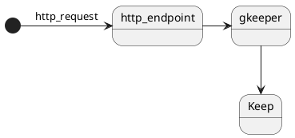

# keep-shopping-list

add item to Google Keep list

## Description

add item to Google Keep list by cloud functions.
You can get the http endpoint which can do it.

If you use IFTTT to post the http_endpoint,
you can add items to Keep by your voice.

## Install

`make install`

## Deploy

deploy to cloud functions.
[git hub actions](https://github.com/taketarouex/gkeeper/actions?query=workflow%3ADelivery)

## Test

`make test`

## Requirements

- poetry
- make
- gcloud

## TODO

- [x] 複数リストに対応する
- [ ] リストの取得をidで行うようにする
- [ ] パスワードを環境変数以外に変える
