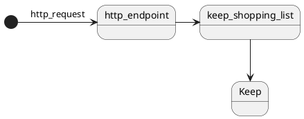

# keep-shopping-list

add item to Google Keep list

## Description

add item to Google Keep list by cloud functions.
You can get the http endpoint which can do it.

If you use IFTTT to post the http_endpoint,
you can add items to Keep by your voice.

## Install

`make install`

## Deploy

deploy to cloud functions.

`make deploy`

## Test

`make test`

## Requirements

- poetry
- make
- gcloud

## TODO

- [ ] cloud functionsのhttp エンドポイントを保護する
- [x] 以下を設定ファイルに分離する
  - ユーザ名
  - リスト名
- [ ] 複数リストに対応する
- [ ] パスワードを環境変数以外に変える
- [ ] deployをterraform経由にする
